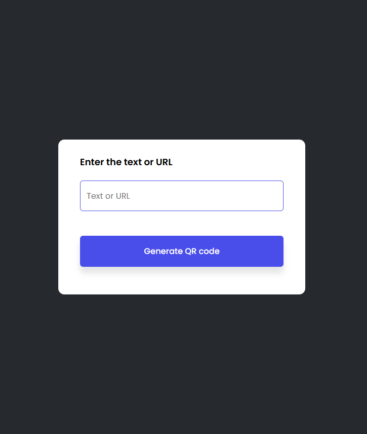
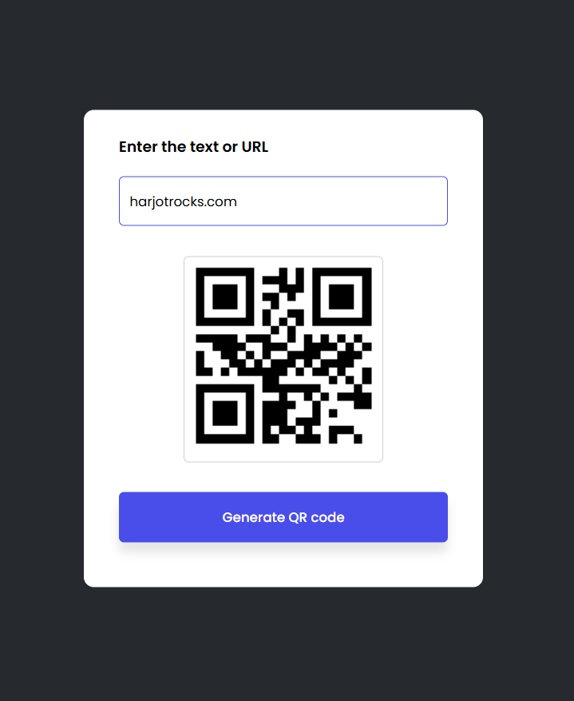

# QR Code Generator ✨

## Description 
A simple QR Code Generator built using HTML, CSS, and JavaScript. This project uses the [GoQR.me API](https://goqr.me/api/) to generate QR codes based on user-provided text or URLs.

## Features 
- 🔹 Generate QR codes from any text or URL.
- 🔹 Real-time QR code creation.
- 🔹 Input validation with error indication when the input is empty.

## Demo 
Link - https://harjotrocks.com/javascript/qr-code-generator/

## Technologies Used 
- **📝 HTML**: Structure of the application.
- **🗳️ CSS**: Styling and layout.
- **🤖 JavaScript**: Logic for generating QR codes.
- **✨ GoQR.me API**: Third-party API for generating QR codes.

## How to Use 
1. 📂 Clone the repository or download the files.
2. 🗃️ Open `index.html` in a web browser.
3. ✏️ Enter text or a URL in the input field.
4. 🔄 Click the **Generate QR Code** button.
5. 🔹 The generated QR code will appear below the input field.

## Code Explanation 
### 📚 HTML
- Provides the input field for user text and a button to trigger the QR code generation.
- Displays the generated QR code image.

### 🗳️ CSS
- Basic styling for layout and error highlighting.

### 💻 JavaScript
```javascript
let imgBox = document.getElementById("imgBox")
let qrImage = document.getElementById("qrImage")
let qrText = document.getElementById("qrText")

function generateQR() {
    if (qrText.value.length > 0) {
        qrImage.src = "https://api.qrserver.com/v1/create-qr-code/?size=150x150&data=" + qrText.value;
        imgBox.classList.add("show-img");
    } else {
        qrText.classList.add("error");
        setTimeout(() => {
            qrText.classList.remove("error");
        }, 1000);
    }
}
```

## Screenshots 
1. **📱 Initial Page View:**
   
2. **🌐 Generated QR Code:**
   

## Improvements 
- 🌟 Add styling to enhance UI/UX.
- 🌐 Support different QR code sizes.
- 🔗 Implement a download button for the QR code image.
- 🔒 Handle special characters and empty input cases.


